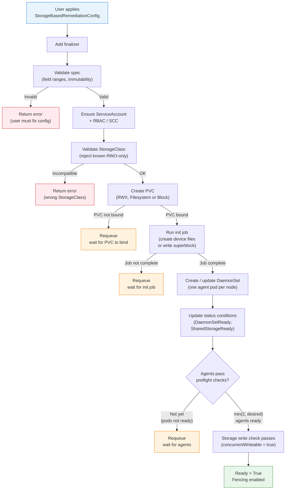
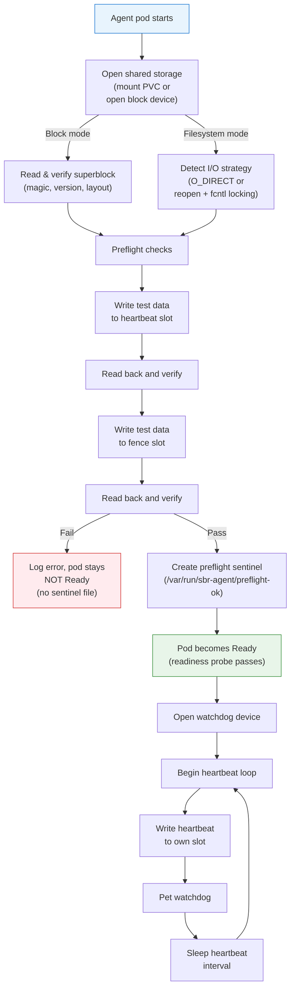
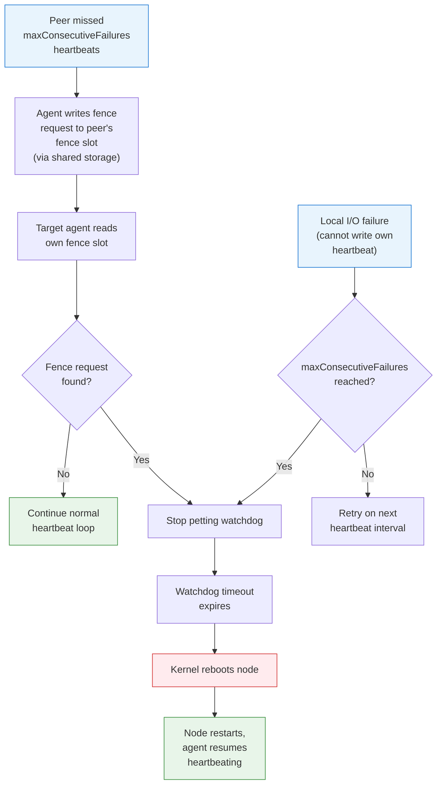
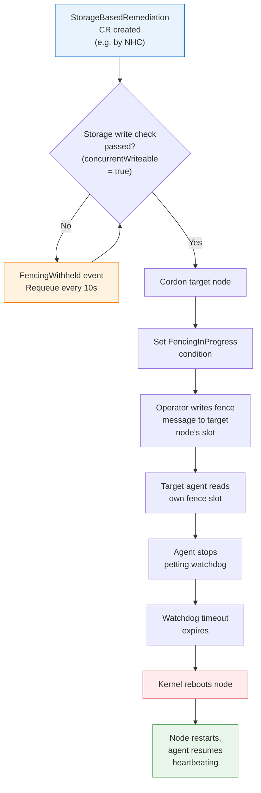

# StorageBasedRemediationConfig User Guide

## Overview and Safety Model

StorageBasedRemediationConfig is a **namespaced** Kubernetes custom resource that configures the Storage-Based Remediation (SBR) operator for automatic node fencing. SBR detects unresponsive nodes and reboots them via a hardware or software watchdog.

### How SBR Works

1. The operator creates a **DaemonSet** that runs an SBR agent on each participating node.
2. All agents share a single **PVC** (filesystem or raw block device) for coordination.
3. Each agent owns a **slot** in the shared storage where it writes periodic heartbeat messages.
4. Every agent reads the heartbeat slots of all other agents. When a peer misses enough consecutive heartbeats, the agent writes a **fence request** to that peer's fence slot.
5. Each agent also reads its own fence slot. If it finds a fence request targeting itself, it stops petting the **watchdog**, which causes the kernel to reboot the node.
6. If the agent itself cannot write heartbeats (local I/O failure), it also stops petting the watchdog and the node reboots.

**The Kubernetes API is not part of the runtime fencing path.** Initial deployment, pod scheduling, PVC provisioning, and configuration changes require the API server. But once agents are running and the shared storage is accessible, heartbeat exchange and fencing operate entirely through the shared storage. A control plane outage does not prevent fencing of an unhealthy node.

### Deployment Lifecycle

The following diagram shows the controller reconciliation sequence from applying a
`StorageBasedRemediationConfig` to a fully operational fencing-capable state.



### Agent Startup

Each SBR agent pod runs through these steps before it begins normal operation.



### Fencing Decision Flow

SBR has two independent fencing paths. **Agent-level fencing** operates entirely
through shared storage and does not depend on the Kubernetes API server.
**Operator-initiated fencing** (via a `StorageBasedRemediation` CR) depends on
the API server for cordoning, finalizers, and condition updates.

#### Agent-Level Fencing (API-independent)

Agents detect peer failures and write fence requests directly to shared storage.
This path continues to work even if the API server is unavailable.



#### Operator-Initiated Fencing (API-dependent)

When an external system (e.g. NHC) creates a `StorageBasedRemediation` CR, the
operator reconciler handles it. This path requires the API server and includes
the storage write check gate.



### Failure Scenarios

| Failure | What Happens |
| ------- | ------------ |
| **Node failure** (crash, hang) | Agent stops writing heartbeats. Peers detect missed heartbeats and write a fence request. If the node recovers enough to read the fence, it reboots. If the node is completely dead, the watchdog timeout reboots it. |
| **Shared storage becomes unavailable** | Agents cannot write heartbeats or read fences. Each agent's local I/O failures accumulate. After `maxConsecutiveFailures` local failures, the agent stops petting the watchdog and the node reboots. This is a last-resort safety mechanism: if storage is down cluster-wide, **all nodes may reboot**. |
| **API server becomes unavailable** | Agent-level fencing is unaffected: agents continue heartbeating and fencing peers via shared storage. Operator-initiated fencing (StorageBasedRemediation CRs) cannot proceed because cordoning and condition updates require the API. New SBR configurations or DaemonSet changes cannot be applied until the API returns. |
| **Network partition** (node isolated from peers but storage accessible) | The isolated node's heartbeats are visible to peers (via shared storage), so peers do not fence it. The isolated node can still see peer heartbeats. No unnecessary reboot. |

> **Watchdog-only mode** (no shared storage): SBR cannot distinguish a node failure from a network partition. The watchdog provides reboot on local hang only. Shared storage is required for safe cross-node fencing. See [Watchdog-Only Mode](#watchdog-only-no-shared-storage) for details.

---

## When to Use Shared Storage vs Watchdog-Only

| Mode | Shared Storage | Cross-Node Fencing | Split-Brain Safe |
| ---- | -------------- | ------------------- | ---------------- |
| Shared storage (filesystem or block) | Required | Yes | Yes |
| Watchdog-only | None | No | No |

> **Warning**: In watchdog-only mode, SBR can only detect and reboot a locally hung node. It cannot detect that a remote node has failed, and it cannot prevent split-brain scenarios. For production HA deployments, always configure shared storage.

---

## Prerequisites

### Required
- Kubernetes cluster (1.21+) — including OpenShift (4.8+)
- Cluster administrator privileges
- Nodes with watchdog devices (hardware or software)

### Required for Shared Storage

#### Filesystem Mode
- A **StorageClass** that provisions ReadWriteMany (RWX) filesystem volumes
- The CSI driver must support simultaneous mount from all participating nodes
- The storage backend must support POSIX file locking (`fcntl` advisory locks)
- Examples: NFS (any provider), CephFS (via Ceph CSI), AWS EFS, Azure Files (NFS-backed only)

#### Block Mode
- A **StorageClass** that provisions ReadWriteMany (RWX) **raw block** volumes (`volumeMode: Block`)
- The CSI driver must support simultaneous device attachment from all participating nodes
- The CSI driver must advertise the `MULTI_NODE_MULTI_WRITER` capability

> **Important**: RWX block is a specialized Kubernetes capability not supported by all storage backends. Most CSI drivers that support RWX only support filesystem volumes. Verify your CSI driver explicitly supports `volumeMode: Block` with `ReadWriteMany` before selecting block mode.

**Pre-deployment verification:**

```bash
# Inspect StorageClass
kubectl get storageclass <name> -o yaml

# Verify CSI driver capabilities
kubectl get csidriver

# Test PVC creation (filesystem mode)
cat <<EOF | kubectl apply -f -
apiVersion: v1
kind: PersistentVolumeClaim
metadata:
  name: sbr-rwx-test
  namespace: sbr-operator-system
spec:
  accessModes: [ReadWriteMany]
  storageClassName: "<your-storage-class>"
  resources:
    requests:
      storage: 1Gi
EOF

# Check that PVC binds
kubectl get pvc sbr-rwx-test -n sbr-operator-system

# Clean up
kubectl delete pvc sbr-rwx-test -n sbr-operator-system
```

For block mode, add `volumeMode: Block` to the test PVC and verify it binds.

---

## Choosing Filesystem vs Block Mode

### Filesystem Mode (default)

Filesystem mode mounts an RWX filesystem-backed PVC and stores heartbeat, fence, and node-map data as regular files in a shared directory.

```yaml
spec:
  sharedStorageClass: "ocs-storagecluster-cephfs"
  # sharedStorageVolumeMode defaults to "Filesystem"
```

The agent automatically detects the storage backend's cache coherency capabilities at startup:
- On backends that support `O_DIRECT` (e.g. local filesystems, some CephFS configurations), reads bypass the kernel page cache.
- On NFS and similar backends where `O_DIRECT` is not reliable, the agent falls back to reopening the file descriptor before each read, combined with `fcntl` byte-range locking where available.
- No manual configuration is needed. The selected strategy is logged at agent startup.

### Block Mode

Block mode uses a raw block RWX PVC. The agent writes heartbeat and fence data directly to a partitioned block device using a self-describing on-disk layout with a versioned superblock.

```yaml
spec:
  sharedStorageClass: "ocs-storagecluster-ceph-rbd"
  sharedStorageVolumeMode: "Block"
```

On first deploy, an init job writes a superblock that defines the region layout (node map, heartbeat slots, fence slots). Agents detect the superblock on startup and use direct synchronous I/O without a filesystem layer.

### Constraints

- `sharedStorageVolumeMode` is **immutable after creation**. Changing it requires deleting the StorageBasedRemediationConfig and creating a new one.
- Filesystem and block mode use different on-disk formats. A PVC initialized for one mode cannot be reused for the other.

---

## Supported Storage Backends

| Storage Backend | Volume Mode | Status |
| --------------- | ----------- | ------ |
| CephFS (via OCS/ODF) | Filesystem | Validated in project integration tests |
| Ceph RBD (via OCS/ODF) | Block | Validated in project integration tests |
| IBM Cloud File Storage (NFS) | Filesystem | Manually validated on IBM Cloud VPC (OCP 4.21) |
| NFS (generic provisioners) | Filesystem | Expected to work; not validated by the project |
| AWS EFS | Filesystem | Expected to work; not validated by the project |
| Azure Files (NFS-backed) | Filesystem | Expected to work; not validated by the project |

> **Not supported:**
> - **Portworx sharedv4 (Block mode)**: Portworx block volumes only allow the first-attaching node to write; other nodes' write checks fail. The storage write check correctly detects this and withholds fencing. Portworx may work in Filesystem mode if the CSI driver supports RWX filesystem volumes.
> - **Azure Files (SMB-backed)**: Does not provide the POSIX file-locking semantics required for coordination.
> - **Object storage** (S3, MinIO): Not a block or filesystem device.
> - **RWO-only block storage** (AWS EBS, Azure Disk, GCP PD): Does not support concurrent access from multiple nodes.
> - **Local storage**: Cannot be shared across nodes.
> - **Read-only volumes** (ConfigMaps, Secrets): Cannot be written to.

> **"Expected to work"** means the backend's documented POSIX/NFS semantics are compatible with SBR's requirements, but the project has not validated this in CI or manual testing. POSIX compliance alone does not guarantee that a particular CSI driver and storage backend combination provides the exact RWX and cache/locking behavior SBR requires. Validate with detect-only mode before enabling fencing.

---

## Installation

### Kubernetes

```bash
# Pin to a specific release version for reproducible deployments
kubectl apply -f https://github.com/medik8s/storage-based-remediation/releases/download/v<VERSION>/install.yaml
```

**Verify installation:**
```bash
kubectl get deployment -n sbr-operator-system
kubectl get pods -n sbr-operator-system
```

### OpenShift

1. **Install from OperatorHub:**
   - Navigate to **Operators** -> **OperatorHub**
   - Search for "Storage Based Remediation"
   - Click **Install** and follow the wizard

2. **Verify operator installation:**

```bash
oc get csv -n openshift-operators | grep storage-based-remediation
oc get pods -n openshift-operators | grep -E 'storage-based-remediation|sbr'
```

> **OpenShift SCC**: The controller automatically creates a ClusterRoleBinding granting the
> `sbr-agent` service account access to the `privileged` SCC. No manual SCC configuration is needed.

---

## Creating an SBR Configuration

### Filesystem Mode Example

```yaml
apiVersion: storage-based-remediation.medik8s.io/v1alpha1
kind: StorageBasedRemediationConfig
metadata:
  name: sbr-config
  namespace: sbr-operator-system
spec:
  sharedStorageClass: "ocs-storagecluster-cephfs"
  sbrTimeoutSeconds: 30
  maxConsecutiveFailures: 5
```

### Block Mode Example

```yaml
apiVersion: storage-based-remediation.medik8s.io/v1alpha1
kind: StorageBasedRemediationConfig
metadata:
  name: sbr-config
  namespace: sbr-operator-system
spec:
  sharedStorageClass: "ocs-storagecluster-ceph-rbd"
  sharedStorageVolumeMode: "Block"
  sbrTimeoutSeconds: 30
  maxConsecutiveFailures: 5
```

### Detect-Only Mode

When `detectOnlyMode` is `Enabled`:
- The watchdog device is **not opened**. The agent uses an internal no-op watchdog. No watchdog timeout can occur. No reboot will be triggered.
- The agent still writes heartbeats to shared storage and monitors peers.
- Storage health is still evaluated and node conditions are updated.
- If the agent exits or crashes in detect-only mode, no reboot occurs because the watchdog was never armed.

This mode is designed for validation: verify that storage I/O works and that peer detection is functioning before enabling fencing.

```yaml
apiVersion: storage-based-remediation.medik8s.io/v1alpha1
kind: StorageBasedRemediationConfig
metadata:
  name: sbr-config
  namespace: sbr-operator-system
spec:
  sharedStorageClass: "efs-sc"
  detectOnlyMode: Enabled
```

### Watchdog-Only (No Shared Storage)

> **Warning**: Without shared storage, SBR cannot perform cross-node fencing. The watchdog provides reboot only when the local node hangs (agent stops petting the watchdog). SBR cannot detect remote node failures and **cannot prevent split-brain**. This mode is not recommended for production HA deployments.

```yaml
apiVersion: storage-based-remediation.medik8s.io/v1alpha1
kind: StorageBasedRemediationConfig
metadata:
  name: sbr-config
  namespace: sbr-operator-system
spec: {}
```

---

## Verifying the Deployment

After applying the StorageBasedRemediationConfig:

```bash
# 1. Check that the PVC is Bound
kubectl get pvc -n <namespace>

# 2. Check that the DaemonSet is running on all targeted nodes
kubectl get daemonset -n <namespace>
kubectl get pods -n <namespace> -l app=sbr-agent -o wide

# 3. Check conditions and storage validation on the config CR
kubectl get storagebasedremediationconfig <name> -n <namespace> \
  -o jsonpath='{range .status.conditions[*]}{.type}: {.status} ({.reason}) - {.message}{"\n"}{end}'
kubectl get storagebasedremediationconfig <name> -n <namespace> \
  -o jsonpath='StorageWriteable: {.status.storageValidation.concurrentWriteable} (nodes: {.status.storageValidation.probedNodeCount}){"\n"}'

# 4. Verify the selected I/O strategy in agent logs
kubectl logs -n <namespace> -l app=sbr-agent | grep -i "O_DIRECT\|reopen\|fcntl\|superblock\|block mode\|filesystem mode"
```

Agent logs to look for indicating the selected I/O strategy:
- **Filesystem with O_DIRECT**: Messages indicating the device was opened with O_DIRECT
- **Filesystem with reopen fallback**: Messages indicating a fallback to reopen-per-read, possibly with fcntl locking
- **Block mode**: Messages indicating a superblock was read and verified

---

## PVC Lifecycle

Understanding the PVC lifecycle is critical for production operations.

### Ownership and Naming

- The controller creates **one PVC per StorageBasedRemediationConfig**, named `<config-name>-shared-storage`.
- The PVC is **owned by the StorageBasedRemediationConfig** via an `ownerReference`. Deleting the config triggers garbage collection of the PVC.
- The PVC is **namespaced** in the same namespace as the config.
- Two configs **cannot share one PVC**. Each config creates its own independent PVC.
- A PVC from a deleted config **is not reused** by a new config with the same name. A new PVC is created.

### Deletion Behavior

When you delete a StorageBasedRemediationConfig:
1. The controller's finalizer runs a node-map cleanup job.
2. The controller patches the underlying PV's `reclaimPolicy` to `Delete` (regardless of the StorageClass default) to prevent orphaned Released PVs.
3. The finalizer is removed, allowing Kubernetes garbage collection to delete the PVC.
4. The PV and underlying storage are deleted.

> **Important**: Deleting a StorageBasedRemediationConfig **permanently deletes the shared storage data** (heartbeat history, node map, fence state). This is by design — the data is coordination state, not user data. A new config with the same name will start with a fresh PVC.

### Changing Volume Mode or StorageClass

Because `sharedStorageVolumeMode` is immutable:
1. Delete the existing StorageBasedRemediationConfig (this deletes the PVC and all agent pods).
2. Create a new StorageBasedRemediationConfig with the desired settings.

> **Warning**: This causes a window where no SBR agents are running. Plan this during a maintenance window.

### Device Initialization

An init job runs on first deploy for both volume modes:
- **Filesystem mode**: Creates the heartbeat and fence device files on the shared filesystem.
- **Block mode**: Writes a versioned superblock that defines the region layout (node map, heartbeat slots, fence slots).

The DaemonSet is not created until the init job completes successfully.

If the init job fails:

```bash
# Check init job status
kubectl get jobs -n <namespace> | grep init
kubectl logs -n <namespace> -l job-name=<init-job-name>
```

If the device needs re-initialization (e.g. corrupt superblock in block mode), delete the StorageBasedRemediationConfig (which deletes the PVC) and recreate it.

---

## Configuration Reference

### Spec Fields

| Field | Type | Default | Description |
| ----- | ---- | ------- | ----------- |
| `sharedStorageClass` | string | (none) | StorageClass for shared storage PVC. Must support RWX. |
| `sharedStorageVolumeMode` | string | `Filesystem` | `Filesystem` or `Block`. Immutable after creation. |
| `watchdogPath` | string | `/dev/watchdog` | Host path to watchdog device. Softdog used as fallback. |
| `nodeSelector` | map | `{node-role.kubernetes.io/worker: ""}` | Label selector for agent DaemonSet. Merged with `kubernetes.io/os=linux`. |
| `sbrTimeoutSeconds` | integer | `30` | Base timing (10-300). Heartbeat interval = value / 2. |
| `maxConsecutiveFailures` | integer | `7` | Missed heartbeats before unhealthy (2-32). |
| `detectOnlyMode` | string | `Disabled` | `Enabled`: observe only, no reboot. `Disabled`: full fencing. |

### Timing Formula

The heartbeat interval is derived from `sbrTimeoutSeconds`:

```
heartbeatInterval = sbrTimeoutSeconds / 2
```

Time-to-detection (how long before a failed node is considered unhealthy):

```
time-to-detection = maxConsecutiveFailures x heartbeatInterval
                   = maxConsecutiveFailures x (sbrTimeoutSeconds / 2)
```

With defaults (`sbrTimeoutSeconds=30`, `maxConsecutiveFailures=7`):

```
time-to-detection = 7 x 15s = 105s
```

The peer-check interval (`sbrTimeoutSeconds / 6`, ~5s with defaults) determines how frequently agents poll peer heartbeat slots. This is faster than the heartbeat interval to reduce the chance that storage jitter is misinterpreted as a missed heartbeat.

The watchdog timeout is a separate value reported by the watchdog hardware/driver (typically 60s). The agent pets the watchdog at `watchdogTimeout / 4`. If the agent stops petting, the kernel reboots the node after the watchdog timeout expires.

### Status Conditions

Each condition object contains:

| Field | Type | Description |
| ----- | ---- | ----------- |
| `type` | string | Condition type (see below) |
| `status` | string | `"True"`, `"False"`, or `"Unknown"` |
| `reason` | string | Short CamelCase reason code |
| `message` | string | Human-readable description |
| `lastTransitionTime` | string (RFC3339) | Time of the last status change |
| `observedGeneration` | int64 | `.metadata.generation` when the condition was set |

#### Condition Types

| Type | `True` | `False` |
| ---- | ------ | ------- |
| **DaemonSetReady** | All desired agent pods are running and ready | No pods scheduled, or some pods not ready |
| **SharedStorageReady** | PVC is Bound, or shared storage is not configured | PVC is not yet Bound or is unavailable |
| **Ready** | DaemonSetReady, SharedStorageReady, and the storage write check are all True | Any dependency not met |

> **Note**: `SharedStorageReady: True` means the PVC is Bound. It does not guarantee that every agent can perform I/O from every node. The **storage write check** (see below) confirms that agents can actually write to the shared device concurrently before fencing is allowed.

### Storage Validation Status

The controller tracks a **storage write check** in `.status.storageValidation` that gates fencing. Until the write check passes, the `Ready` condition stays `False` and the fencing reconciler withholds fence requests with a `FencingWithheld` event.

```bash
# Check storage validation status
kubectl get storagebasedremediationconfig <name> -n <namespace> \
  -o jsonpath='{.status.storageValidation}'
```

| Field | Type | Description |
| ----- | ---- | ----------- |
| `concurrentWriteable` | *bool | `true` once confirmed; `nil` while waiting or re-checking |
| `probedNodeCount` | int32 | Node count at the time write capability was last confirmed |
| `lastProbeTime` | string (RFC3339) | When the check last ran |
| `message` | string | Human-readable status detail |

**How the write check works:**

1. Each agent runs a real write/read-back test against its heartbeat and fence slots at startup (as part of preflight checks).
2. The agent pod only becomes Ready after the preflight sentinel file is created.
3. The controller confirms the write check when at least **min(2, desired)** agent pods are Ready (or 1 of 1 for single-node clusters).
4. Once confirmed (`concurrentWriteable=true`), the result is **sticky** — a temporary readiness dip (e.g. a node rebooting) does not clear it.
5. If the DaemonSet's `desiredNumberScheduled` grows past `probedNodeCount` (new nodes joined), the confirmation is **invalidated** and a fresh full-ready pass is required at the new count.

> **Why this matters**: The write check prevents fencing on storage backends that accept PVC binding but do not actually support concurrent multi-node writes (e.g. some block storage drivers that only allow single-writer). Without this gate, false fence requests could be issued.

**Example** (abbreviated):

```yaml
status:
  storageValidation:
    concurrentWriteable: true
    probedNodeCount: 3
    lastProbeTime: "2026-07-12T10:01:30Z"
    message: "Confirmed 3 of 3 SBR agents can write to shared storage concurrently"
  conditions:
  - type: DaemonSetReady
    status: "True"
    reason: DaemonSetReady
    message: All 3 SBR agent pods are ready
    lastTransitionTime: "2026-07-12T10:00:00Z"
    observedGeneration: 1
  - type: SharedStorageReady
    status: "True"
    reason: SharedStorageConfigured
    message: "Shared storage PVC 'sbr-config-shared-storage' is configured"
    lastTransitionTime: "2026-07-12T10:00:00Z"
    observedGeneration: 1
  - type: Ready
    status: "True"
    reason: Ready
    message: StorageBasedRemediationConfig is ready
    lastTransitionTime: "2026-07-12T10:01:30Z"
    observedGeneration: 1
```

---

## Production Rollout Procedure

### 1. Deploy with Detect-Only Mode

```yaml
spec:
  sharedStorageClass: "<your-storage-class>"
  detectOnlyMode: Enabled
```

Verify:
- PVC is Bound
- All agent pods are Ready
- Storage write check has passed (`storageValidation.concurrentWriteable: true`)
- Config condition `Ready: True`
- Agent logs show the expected I/O strategy for your storage backend
- No I/O errors in agent logs

### 2. Observe for a Maintenance Window

Monitor `sbr_agent_status_healthy` and `sbr_device_io_errors_total` metrics. Confirm no false positives under normal cluster operations.

### 3. Enable Fencing

```bash
kubectl patch storagebasedremediationconfig <name> -n <namespace> \
  --type merge -p '{"spec": {"detectOnlyMode": "Disabled"}}'
```

### 4. Validate Fencing

> **Warning**: A fencing test **will reboot a production node**. Perform this during an approved maintenance window. Confirm that workloads can tolerate the loss of one node. Ensure at least one other node remains healthy.

**Before testing:**
- Identify the test node
- Confirm all SBR agents are Ready: `kubectl get pods -n <namespace> -l app=sbr-agent`
- Confirm the config shows `Ready: True`
- Ensure workloads on the test node can tolerate eviction

**To simulate a node failure**, trigger a kernel panic or hard-stop the kubelet on the test node. `kubectl cordon` does **not** simulate a node failure — a cordoned node continues running its SBR agent and heartbeating normally.

Example (requires SSH or debug access to the test node):
```bash
# Kubernetes (via kubectl debug, requires --profile=sysadmin)
kubectl debug node/<test-node> -it --image=busybox --profile=sysadmin \
  -- chroot /host sh -c 'echo c > /proc/sysrq-trigger'

# OpenShift
oc debug node/<test-node> -- chroot /host sh -c 'echo c > /proc/sysrq-trigger'
```

**Verify fencing occurred:**
- The test node should reboot within approximately `time-to-detection + watchdog-timeout` seconds
- Agent logs on surviving nodes should show fence request written for the test node
- After reboot, the test node's agent should restart and resume heartbeating

**If fencing does not occur:**
- Check for `FencingWithheld` events: `kubectl get events -n <namespace> --field-selector reason=FencingWithheld`
- Verify the storage write check passed: `storageValidation.concurrentWriteable: true`
- Check surviving agent logs for errors reading/writing shared storage
- Check if the config condition `Ready` is True
- Verify shared storage is accessible from all nodes

---

## Performance Tuning

### Timeout Guidance

Lower `sbrTimeoutSeconds` means faster detection but more sensitivity to storage latency and transient I/O errors. Higher values are more tolerant of jitter but increase time-to-fence.

| Profile | `sbrTimeoutSeconds` | `maxConsecutiveFailures` | Time to Detect | Use Case |
| ------- | ------------------- | ----------------------- | -------------- | -------- |
| Aggressive | 10 | 3 | 15s | Low-latency local-attached or Ceph storage |
| Standard | 30 | 7 | 105s | Most production deployments |
| Conservative | 60 | 10 | 300s | High-latency NFS or noisy cloud storage |

These values are general guidance. Validate against your actual storage latency profile using detect-only mode before enabling fencing.

---

## Multiple StorageBasedRemediationConfig Support

The SBR operator supports multiple StorageBasedRemediationConfig resources in the same namespace.

- **Shared Service Account**: All configs share the same `sbr-agent` service account. RBAC and SCC permissions are shared and are not a security boundary between configs.
- **Separate DaemonSets**: Each config creates its own DaemonSet (`sbr-agent-<config-name>`) and PVC (`<config-name>-shared-storage`).
- **Deleting one config** removes only its DaemonSet and PVC. The shared service account is not deleted, as other configs may still use it.

> **Warning — overlapping node selectors**: If two configs select the same node, **two SBR agents will run on that node**. Each agent independently monitors and fences via its own shared storage. This is not a tested or supported configuration. Ensure node selectors are **mutually exclusive**.

### Example: Gradual Rollout

```yaml
# Stable configuration — explicitly excludes canary nodes
apiVersion: storage-based-remediation.medik8s.io/v1alpha1
kind: StorageBasedRemediationConfig
metadata:
  name: production-sbr
  namespace: sbr-operator-system
spec:
  sharedStorageClass: "ocs-storagecluster-cephfs"
  nodeSelector:
    sbr-pool: "stable"
---
# Canary configuration — separate node pool
apiVersion: storage-based-remediation.medik8s.io/v1alpha1
kind: StorageBasedRemediationConfig
metadata:
  name: canary-sbr
  namespace: sbr-operator-system
spec:
  sharedStorageClass: "ocs-storagecluster-cephfs"
  nodeSelector:
    sbr-pool: "canary"
  sbrTimeoutSeconds: 15
```

---

## Monitoring and Observability

### Prometheus Metrics

The SBR agent exposes metrics on port **8082**:

| Metric | Type | Description |
| ------ | ---- | ----------- |
| `sbr_agent_status_healthy` | Gauge | Agent health (1=healthy, 0=unhealthy) |
| `sbr_device_io_errors_total` | Counter | Cumulative I/O errors with shared storage |
| `sbr_watchdog_pets_total` | Counter | Cumulative successful watchdog pets |
| `sbr_peer_status` | Gauge | Per-peer node status |
| `sbr_self_fenced_total` | Counter | Self-fencing events |

See [SBR Agent Prometheus Metrics](sbr-agent-prometheus-metrics.md) for the complete list with label descriptions.

### ServiceMonitor

The `port` field must match the named port on the Service fronting the agent pods (see `config/prometheus/`). The ServiceMonitor must be created in a namespace that your Prometheus instance is configured to discover.

```yaml
apiVersion: monitoring.coreos.com/v1
kind: ServiceMonitor
metadata:
  name: sbr-agent-metrics
  namespace: <namespace-discovered-by-prometheus>
spec:
  namespaceSelector:
    matchNames:
    - sbr-operator-system
  selector:
    matchLabels:
      app: sbr-agent
  endpoints:
  - port: metrics
    interval: 30s
    path: /metrics
```

### Alerting Rules

Adapt these examples to your environment. The metric names and semantics should be verified against the [metrics documentation](sbr-agent-prometheus-metrics.md).

```yaml
groups:
- name: sbr-agent
  rules:
  - alert: SBRAgentUnhealthy
    expr: sbr_agent_status_healthy == 0
    for: 1m
    labels:
      severity: critical
    annotations:
      summary: "SBR Agent unhealthy on {{ $labels.instance }}"

  - alert: SBRStorageIOErrors
    expr: rate(sbr_device_io_errors_total[5m]) > 0
    for: 2m
    labels:
      severity: warning
    annotations:
      summary: "SBR storage I/O errors on {{ $labels.instance }}"
```

---

## Troubleshooting

### PVC Stuck in Pending

```bash
kubectl describe pvc <config-name>-shared-storage -n <namespace>
```

Common causes:
- StorageClass does not support the requested access mode (RWX)
- StorageClass does not support the requested volume mode (Block)
- CSI driver not installed or not running
- Insufficient storage quota

### Agent Pods Not Starting

```bash
kubectl describe pods -n <namespace> -l app=sbr-agent
kubectl logs -n <namespace> <pod-name>
```

Common causes:
- **PVC not bound**: Agent pods cannot start until the shared storage PVC is Bound
- **SCC issues (OpenShift only)**: Verify ClusterRoleBinding: `oc get clusterrolebinding | grep sbr-agent`
- **Missing watchdog**: Specified `watchdogPath` does not exist and softdog loading failed

### Preflight Check Failures

The agent validates storage accessibility at startup. Preflight checks include a **real write/read-back test** against the node's heartbeat and fence slots. The pod only becomes Ready after the preflight sentinel file (`/var/run/sbr-agent/preflight-ok`) is created. If preflight fails, the pod stays not-ready, the storage write check cannot pass, and fencing is withheld.

```bash
kubectl logs -n <namespace> <pod-name> | grep -i "pre-flight\|preflight\|runtime I/O probe"
```

Common failures:
- **SBR device not accessible**: PVC not mounted, or storage backend is unreachable from this node
- **Runtime I/O probe failed**: The agent could not write and read back data from its slot. This typically indicates the storage backend does not support concurrent multi-node writes (e.g. a block volume that only allows single-writer access)
- **Watchdog device not found**: Specified `watchdogPath` does not exist and softdog module could not be loaded
- **Node name validation**: Node name exceeds 256 characters or contains control characters

### Init Job Failure

```bash
kubectl get jobs -n <namespace> | grep init
kubectl logs -n <namespace> -l job-name=<init-job-name>
```

If the init job fails, the DaemonSet will not be created. Check that the PVC is bound and that the storage backend is accessible from the node where the init job pod was scheduled.

### Stale Data or Split-Brain Symptoms

If agents on different nodes appear to see different shared storage state:
- Verify the storage backend provides true RWX semantics (not RWO masquerading as RWX)
- Check agent logs for I/O errors or cache coherency fallback messages
- For NFS: verify the NFS server is healthy and client mounts are not stale (`mount | grep nfs`)
- For NFS: the agent's reopen-per-read strategy mitigates many client-side caching issues, but cannot compensate for an unreachable NFS server or a broken network path

### Fencing Withheld (FencingWithheld Event)

If you see `FencingWithheld` events on StorageBasedRemediation resources, fencing is being held back because the storage write check has not passed.

```bash
kubectl get events -n <namespace> --field-selector reason=FencingWithheld
kubectl get storagebasedremediationconfig <name> -n <namespace> \
  -o jsonpath='{.status.storageValidation}{"\n"}'
```

Common causes:
- **Not enough agents ready**: The write check requires at least min(2, desired) agent pods to be Ready. Wait for agents to start and pass preflight.
- **New nodes joined**: If `desiredNumberScheduled` grew past the last confirmed `probedNodeCount`, the write check resets and waits for agents on the new nodes.
- **Storage backend does not support concurrent writes**: Some block storage backends (e.g. Portworx sharedv4) only allow one node to write. The write check correctly prevents fencing in this case. Switch to a backend that supports true RWX multi-writer.
- **Agent preflight failing**: Check agent logs for preflight errors (see [Preflight Check Failures](#preflight-check-failures)).

### Storage Latency Causing False Positives

If nodes are being fenced under normal operations:
- Increase `sbrTimeoutSeconds` to tolerate higher storage latency
- Increase `maxConsecutiveFailures` to require more missed heartbeats before fencing
- Check `sbr_device_io_errors_total` metrics for transient I/O errors
- Use detect-only mode to observe behavior without triggering reboots

### Two SBR Configs Selecting the Same Node

If a node runs two SBR agent pods, they will operate independently and may conflict. Use `nodeSelector` to ensure each config targets a distinct set of nodes.

---

## Security Considerations

### Privileges Required

The SBR agent requires elevated privileges for:
- **Watchdog access**: Direct hardware device access (`/dev/watchdog`)
- **System reboot**: The watchdog timeout triggers a kernel reboot
- **Shared storage**: Read/write access to the shared PVC
- **Host PID namespace**: Required for watchdog device interaction

### OpenShift Security (SCC)

On OpenShift, the controller automatically creates a ClusterRoleBinding binding the `sbr-agent` service account to the `privileged` SCC. Verify:

```bash
oc get clusterrolebinding | grep sbr-agent
```

### Network Security

- **Metrics endpoint**: Port 8082 (Prometheus scraping)
- **No inter-agent network communication**: Agents coordinate exclusively via shared storage
- **Storage network**: Agents require network access to the storage backend

---

## Pre-Production Checklist

Before enabling fencing in production:

- [ ] Operator installed and healthy
- [ ] StorageClass supports required access mode (RWX) and volume mode (Filesystem/Block)
- [ ] PVC Bound (`kubectl get pvc -n <namespace>`)
- [ ] All intended nodes can mount and access the shared storage
- [ ] All agent pods Ready (`kubectl get pods -n <namespace> -l app=sbr-agent`)
- [ ] Storage write check passed (`storageValidation.concurrentWriteable: true`)
- [ ] Config condition `Ready: True`
- [ ] Agent logs show expected I/O strategy (no unexpected errors)
- [ ] No overlapping SBR configurations on the same nodes
- [ ] Watchdog device available on all intended nodes
- [ ] Prometheus monitoring configured with alerts on `sbr_agent_status_healthy`
- [ ] Detect-only observation completed (at least one maintenance window)
- [ ] Fencing test completed during maintenance window
- [ ] Expected time-to-detection documented (`maxConsecutiveFailures x sbrTimeoutSeconds / 2`)
- [ ] StorageBasedRemediationConfig stored in version control

---

## Reference

### Sample Configurations

- [Sample configurations](../config/samples/)
- [Generated CRD](../config/crd/bases/storage-based-remediation.medik8s.io_storagebasedremediationconfigs.yaml)

### Design and Technical Details

For implementation details (on-disk format, superblock layout, I/O strategies, cache coherency internals):

- [RWX Block Volume Design](design/rwx-block-volume-support.md)
- [Storage Validation Design](design/storage-validation.md)
- [SBR Coordination Strategies](sbr-coordination-strategies.md)
- [SBR Agent Prometheus Metrics](sbr-agent-prometheus-metrics.md)

### Repository

- <https://github.com/medik8s/storage-based-remediation>
